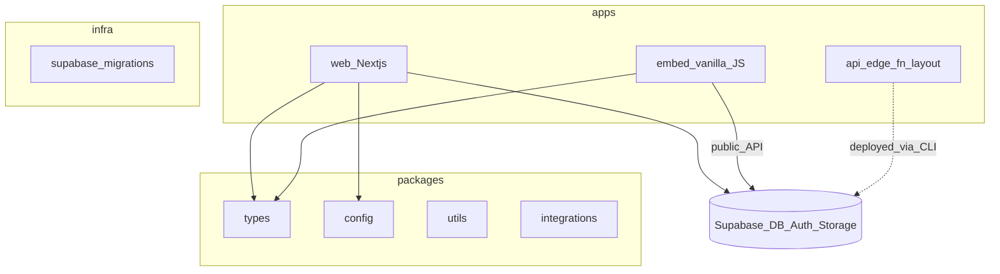

# Architecture overview

High-level map of the monorepo. Detail lives in `docs/architecture/` as features are implemented.

- **Tenant isolation:** Postgres RLS on all tables (spec §4).
- **OwnerRez:** OAuth and webhooks via Edge Functions (server-side; no PKCE per spec).
- **Embed:** Single minimized bundle, no React, isolated from `apps/web`.

See [`docs/decisions/adr-0001-repo-structure.md`](docs/decisions/adr-0001-repo-structure.md) for repo layout and Edge Function paths.
