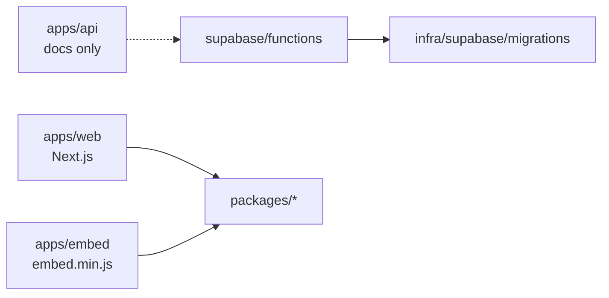

# GeoWaypoint

Monorepo for GeoWaypoint: resorts, maps, sites, OwnerRez embed, webhooks, and analytics.

This file is the repository index. It is not a second product spec.

---

## Authority

| Layer | Source | Role |
| --- | --- | --- |
| Product behavior | `GeoWaypoint_Cursor_Build_Spec.docx` | Single source of truth |
| Structure and process | `PROJECT_BOOTSTRAP` | How the repo is shaped and how work is opened |
| Execution order | Cursor build plan | Follow it. Do not edit the plan file for governance churn. |
| Persistent rules | [`docs/governance/GEOWAYPOINT_BUILD_GOVERNANCE.md`](docs/governance/GEOWAYPOINT_BUILD_GOVERNANCE.md) | Standing constraints |

If these sources disagree, the spec wins for behavior. Governance wins for process.

---

## Layout

```text
GeoWaypoint
├── apps/web          Next.js admin and dashboard
├── apps/api          Edge function layout docs (see ADR-0001)
├── apps/embed        Framework-free embed.min.js
├── packages/*        Shared code used by two or more apps
├── infra/supabase/migrations
└── docs/
```



- `apps/web` — Next.js admin and dashboard.
- `apps/api` — Edge function layout documentation. Deployed functions live under `supabase/functions` (ADR-0001).
- `apps/embed` — Framework-free `embed.min.js` bundle.
- `packages/*` — Shared code only when used by two or more apps.
- `infra/supabase/migrations` — Timestamp-prefixed SQL migrations.
- `docs/` — All documentation.

---

## Prerequisites

- Node.js 18.18+
- npm workspaces
- Supabase CLI for local database and functions

---

## Quick start

```bash
npm install
npm run env:web
# or: cp apps/web/.env.example apps/web/.env.local
npm run dev
```

`npm run env:web` copies `apps/web/.env.example` to `apps/web/.env.local` only if `.env.local` does not exist. It will not overwrite an existing file.

---

## Scripts

| Script | Description |
| --- | --- |
| `npm run dev` | Start Next.js (`apps/web`) |
| `npm run build` | Production build for web |
| `npm run embed:build` | Build embed bundle |
| `npm run lint` | Lint all workspaces |
| `npm run typecheck` | Typecheck workspaces |

---

## Spec location

Place `GeoWaypoint_Cursor_Build_Spec.docx` next to this repository, or document its path in `docs/architecture/`.

If the spec moves, update that architecture note. Do not create a second source of truth.
